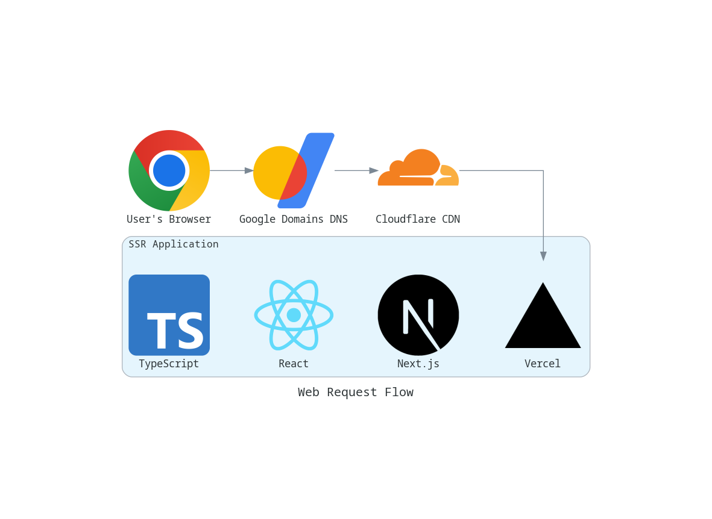

# My personal site

Welcome! Here lives the source code for [`willlaeri.com`](https://willlaeri.com). It's a [Next.js](https://nextjs.org/) project bootstrapped with [`create-next-app`](https://github.com/vercel/next.js/tree/canary/packages/create-next-app).

## Overview



When a user makes a request to [`https://willlaeri.com`](https://willlaeri.com) it first gets routed to DNS servers managed by [Google Domains](https://domains.google/) which routes the request to [Cloudflare's](https://www.cloudflare.com/) content delivery network (CDN). Cloudflare forwards the request onto [Vercel's](https://vercel.com/) edge network which hosts the Next.js application. Next.js is simply a framework for writing server-side rendered (SSR) web applications using [React](https://reactjs.org/) written in [TypeScript](https://www.typescriptlang.org/).

## Getting started

First, make sure you are running the right version of Node.js locally. This step requires
[`nvm`](https://github.com/nvm-sh/nvm) if you don't have it installed already.

```bash
nvm use
```

Then, install package dependencies.

```bash
npm i
```

Finally, run the application in development mode locally.

```bash
npm run dev
```

Open [http://localhost:3000](http://localhost:3000) with your browser to see the result. 🎉

## Testing

First, run the app locally in development mode.

```bash
npm run dev
```

In another terminal, you can run unit tests with [Jest](https://jestjs.io/)
and end-to-end testswith [Cypress](https://www.cypress.io/).

```bash
npm t
```

## Performance analysis

To run performance analysis on the app locally, first build the app for production.

```bash
npm run build && npm run start
```

Then, in another terminal you can run a [Lighthouse](https://developers.google.com/web/tools/lighthouse)
report on the running production build.

```bash
npm run analyze:local
```

You can also run the Lighthouse analysis against the website deployed to production. It's just a simple site, but it should get some good marks for performance. 😉

```bash
npm run analyze:prod
```

# Documentation

The architecture diagrams are generated by an npm script that reads from the `docs/src` directory.

```bash
npm run docs:generate
```

The python script to generate the artifacts runs in a docker container that includes the necessary environment dependencies. It has volume bind mounts for the source scripts and the artifacts directories so the output of the process running in the docker container gets written to the local file system at `docs/artifacts`.
